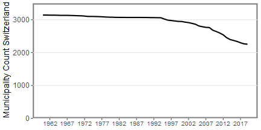

```{r setup, include = FALSE}
knitr::opts_chunk$set(
  collapse = TRUE,
  comment = "#>"
)

library(SMMT)

```

## Introduction

In Switzerland, the landscape of municipalities is changing rapidly mainly due to mergers. The Swiss Municipality Merger Tool (SMMT) automatically detects these mutations and maps municipalities of an old state to municipalities of a new state. The aim of this vignette is to illustrate how to use the functionality of the SMMT.
<center>

</center>
## How To

### Setup

1) Download & unpack the Swiss municipality inventory from the Federal Statistical Office website (https://www.bfs.admin.ch/bfsstatic/dam/assets/11467405/master).  
2) Import the inventory into the workspace

```{r, eval=FALSE}
# File name depends on inventory version.
file_path_inventory_xml <- "path/to/eCH0071_XXXXXX.xml"

mutations <- import_CH_municipality_inventory(file_path = file_path_inventory_xml)
```

### Get Mapping Table

1) Define the old state and the new state. Example:

```{r}
old_state <- as.POSIXct("1961-01-01")
new_state <- as.POSIXct("1963-01-01")
```

2) Get mapping table

```{r, echo = FALSE}
mutations <- structure(list(hist_id = c(11227L, 11240L, 13189L),
district_hist_id = c(10025L, 10025L, 10025L),
kanton_abbr = c("AG", "AG", "AG"),
bfs_nr = c(4025L, 4021L, 4021L),
name = c("Daettwil", "Baden", "Baden"),
admission_nr = c(1000L, 1000L, 1004L),
admission_mode = c(20L, 20L, 26L),
admission_date = structure(c(-315619200, -315619200, -252460800),
class = c("POSIXct", "POSIXt"), tzone = ""),
abolition_nr = c(1004L, 1004L, NA),
abolition_mode = c(29L, 26L, NA),
abolition_date = structure(c(-252547200, -252547200, NA),
class = c("POSIXct", "POSIXt"), tzone = ""),
change_date = structure(c(-252547200,
-252547200, -252460800), class = c("POSIXct", "POSIXt"), tzone = "")),
row.names = c(NA, -3L), class = c("tbl_df", "tbl", "data.frame"))
```

```{r}
mapping_object <- map_old_to_new_state(mutations, old_state, new_state)
```
Excerpt of mapping table: 

|bfs_nr_new | name_new | bfs_nr_old | name_old |
|-----|------|-----|-----|
|4021 | Baden | 4021 | Baden |
|4021 | Baden | 4025 | Daettwil|


## Definitions

* Spatial reference (German: Raumbezug): Set of municipalities at a given point in time. For example, the spatial reference of the Federal Population census year 2000 is the 5 December 2000.

## Further information

* Details about the Swiss Municipality inventory (German: Historisiertes Gemeindeverzeichnis) at the Federal Statistical Office : https://www.bfs.admin.ch/bfs/de/home/grundlagen/agvch/historisiertes-gemeindeverzeichnis.html
* Details about the defined standard: https://www.ech.ch/de/standards/47999
